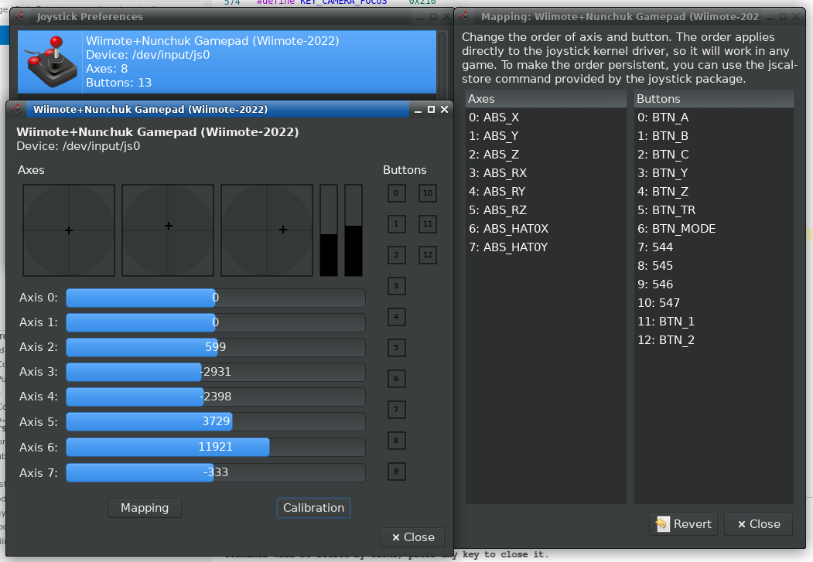

# Wiimote-2022 by gatopeich

Tired of not being able to use your wiimote on Linux games out of the box?
This driver update provides a Wiimote based gamepad directly usable as a standard game controller.
It does so by combining Wiimote's buttons, accelerometer, and Nunchuk into a single input device.

Use "gamepad=1" parameter to gather Wiimote and Nunchuk into a single device to be used as a
gamepad per [Linux Gamepad Specification](https://www.kernel.org/doc/html/latest/input/gamepad.html)

Otherwise with "gamepad=0" the old driver behaviour applies, with separate devices per function etc.

# Installation
Install with "sudo dkms install ." from the folder with dkms.conf
Otherwise, run "make" inside the src folder and load module manually before connecting by bluetooth:
```
$ sudo modprobe -v ff-memless
$ sudo rmmod hid-wiimote; sudo insmod hid-wiimote.ko gamepad=1
```

**Don't forget to set param "gamepad=1" to take advantage of the new features in this driver!**



# TO-DO

* [DONE] Linux layout
* [...] "horizontal" layout ((no Nunchuk)
* [...] PSX layout
* [...] Steam layout
* [...] MotionPlus support
* [...] Rumble
* [...] Differential accelerometer Nunchuk-Wiimote

# Mapping for Linux Gamepad Specification

```
          ____________________________              __
         / [__ZL__]          [__ZR__] \               |
        / [__ TL __]        [__ TR __] \              | Front Triggers
     __/________________________________\__         __|
    /                                  _   \          |
   /      /\           __             (N)   \         |
  /       ||      __  |MO|  __     _       _ \        | Main Pad
 |    <===DP===> |SE|      |ST|   (W) -|- (E) |       |
  \       ||    ___          ___       _     /        |
  /\      \/   /   \        /   \     (S)   /\      __|
 /  \________ | LS  | ____ |  RS | ________/  \       |
|         /  \ \___/ /    \ \___/ /  \         |      | Control Sticks
|        /    \_____/      \_____/    \        |    __|
|       /                              \       |
 \_____/                                \_____/

     |________|______|    |______|___________|
       D-Pad    Left       Right   Action Pad
               Stick       Stick

                 |_____________|
                    Menu Pad
```

Minimal Mapping / single handed:

Wiimote D-Pad ~ BTN_DPAD_*
Wiimote A     ~ BTN_A (enables gamepad detection)
Wiimote B     ~ BTN_TR (main trigger)
Wiimote 1     ~ BTN_1 (Not too useful in vertical posture)
Wiimote 2     ~ BTN_2
Wiimote Home  ~ BTN_HOME (1-button menu pad)
Wiimote -     ~ BTN_WEST (more useful than select/start?)
Wiimote +     ~ BTN_EAST
Accelerometer ~ ABS_RX~Z
Nunchuk stick ~ ABS_X~Y
Nunchuk Accel ~ ABS_HAT1X~Y, ABS_Z
Nunchuk C     ~ BTN_TL
Nunchuk Z     ~ BTN_ZL


Horizontal Gamepad Mapping / two-handed:

Wiimote D-Pad ~ BTN_DPAD_* (right is up)
Wiimote A     ~ BTN_WEST (W)
Wiimote B     ~ BTN_TL 
Wiimote 1     ~ BTN_SOUTH enables gamepad detection
Wiimote 2     ~ BTN_EAST
Wiimote Home  ~ BTN_HOME (1-button menu pad)
Wiimote -     ~ BTN_BACK (more useful than select/start?)
Wiimote +     ~ BTN_FORWARD
Accelerometer ~ ABS_RX~Z
Rumble        ~ FF_RUMBLE

## Detection of horizontal position with Accelerator
Note: Accel-X is -20% (~ -100) when Wiimote is horizontal with the D-pad to the left side,
+20% (~=+100) when the D-pad is on the right side, centered ~ 0 when vertical
```
.------------------------------------.
¦   _│^│_           (+)            . ¦ Accel-X ~ -20%
¦  |_   _|   (A)    (H)    (1) (2) : ¦ Accel-Y ~ +15%
¦⊝   |_|            (-)            · ¦ Accel-Z ~   0
`------------------------------------´

.------------------------------------.
¦ .              (-)         _│^│_  ⊝¦ Accel-X ~ +20%
¦ : (2) (1)      (H)   (A)  |_   _|  ¦ Accel-Y ~ +15%
¦ ·              (+)          |_|    ¦ Accel-Z ~   0
`------------------------------------´
```
Accel-Z detects up-down movement of the frontside, up being negative.
It is Zero when vertical, +20% when wiimote sits on a table facing up, -20% facing down


# Playstation layout

- Left Joy-X = ABS_X => Nunchuk Joy-X
- Left Joy-Y = ABS_Y => Nunchuk Joy-Y
- Right Joy-X = ABS_RX => Accelerometer X
- Right Joy-Y = ABS_RY => Accelerometer Z (vertical)
- ABS_Z,  ds_report->z
- ABS_RZ, ds_report->rz

	value = ds_report->buttons[0] & DS_BUTTONS0_HAT_SWITCH;
	if (value >= ARRAY_SIZE(ps_gamepad_hat_mapping))
		value = 8; /* center */
- ABS_HAT0X, ps_gamepad_hat_mapping[value].x
- ABS_HAT0Y, ps_gamepad_hat_mapping[value].y

- BTN_WEST,   ds_report->buttons[0] & DS_BUTTONS0_SQUARE
- BTN_SOUTH,  ds_report->buttons[0] & DS_BUTTONS0_CROSS
- BTN_EAST,   ds_report->buttons[0] & DS_BUTTONS0_CIRCLE
- BTN_NORTH,  ds_report->buttons[0] & DS_BUTTONS0_TRIANGLE
- BTN_TL,     ds_report->buttons[1] & DS_BUTTONS1_L1
- BTN_TR,     ds_report->buttons[1] & DS_BUTTONS1_R1
- BTN_TL2,    ds_report->buttons[1] & DS_BUTTONS1_L2
- BTN_TR2,    ds_report->buttons[1] & DS_BUTTONS1_R2
- BTN_SELECT, ds_report->buttons[1] & DS_BUTTONS1_CREATE
- BTN_START,  ds_report->buttons[1] & DS_BUTTONS1_OPTIONS
- BTN_THUMBL, ds_report->buttons[1] & DS_BUTTONS1_L3
- BTN_THUMBR, ds_report->buttons[1] & DS_BUTTONS1_R3
- BTN_MODE,   ds_report->buttons[2] & DS_BUTTONS2_PS_HOME

# Steam layout

**TO BE DONE!**


- BTN_TR2 => 
- BTN_TL2 => 
- BTN_TR => 
- BTN_TL => 
- BTN_Y => 
- BTN_B => 
- BTN_X => 
- BTN_A => 
- BTN_DPAD_UP => 
- BTN_DPAD_RIGHT => 
- BTN_DPAD_LEFT => 
- BTN_DPAD_DOWN => 
- BTN_SELECT => 
- BTN_MODE => 
- BTN_START => 
- BTN_GEAR_DOWN => 
- BTN_GEAR_UP => 
- BTN_THUMBR => 
- BTN_THUMBL => 
- BTN_THUMB => 
- BTN_THUMB2 => 

- ABS_X, -32767, 32767 => Left Joy-X (Nunchuck)
- ABS_Y, -32767, 32767 => Left Joy-Y (Nunchuck)
- ABS_RX, -32767, 32767 => Right Joy-X (Accelerometer)
- ABS_RY, -32767, 32767 => Right Joy-Y (Accelerometer)
- ABS_HAT0X, -32767, 32767 => Gyro controls?
- ABS_HAT0Y, -32767, 32767 => Gyro controls?
- ABS_HAT2Y, 0, 255 => Analog R Trigger?
- ABS_HAT2X, 0, 255 => Analog L Trigger?

	input_abs_set_res(input, ABS_X, STEAM_JOYSTICK_RESOLUTION);
	input_abs_set_res(input, ABS_Y, STEAM_JOYSTICK_RESOLUTION);
	input_abs_set_res(input, ABS_RX, STEAM_PAD_RESOLUTION);
	input_abs_set_res(input, ABS_RY, STEAM_PAD_RESOLUTION);
	input_abs_set_res(input, ABS_HAT0X, STEAM_PAD_RESOLUTION);
	input_abs_set_res(input, ABS_HAT0Y, STEAM_PAD_RESOLUTION);
	input_abs_set_res(input, ABS_HAT2Y, STEAM_TRIGGER_RESOLUTION);
	input_abs_set_res(input, ABS_HAT2X, STEAM_TRIGGER_RESOLUTION);
